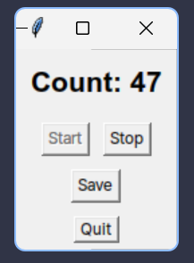

# Typing counter

<p align="center">
  
</p>

매일 얼마나 많은 키를 입력하는지 기록하고 통계를 보여주는 타이핑 카운터입니다.

## 사용 방법

1.  **설치:** 먼저 터미널을 열고 다음 명령어를 입력하여 `typecount`를 설치합니다.

    ```bash
    uv sync
    uv pip install typecount
    ```

    이 명령어는 `typecount`를 여러분의 시스템에 다운로드하고 설치해 줍니다. 설치가 완료되면 다음 단계로 넘어갈 수 있습니다.

2.  **실행:** 설치가 완료되면 터미널에 다음 명령어를 입력하여 `typecount`를 실행합니다.

    ```bash
    uv run typecount
    ```

**팁:**

* `typecount`를 실행해두면 컴퓨터를 사용하는 동안 자동으로 타이핑 횟수가 기록됩니다.
* 기록된 데이터는 파일을 백업해두는 것이 좋습니다.
